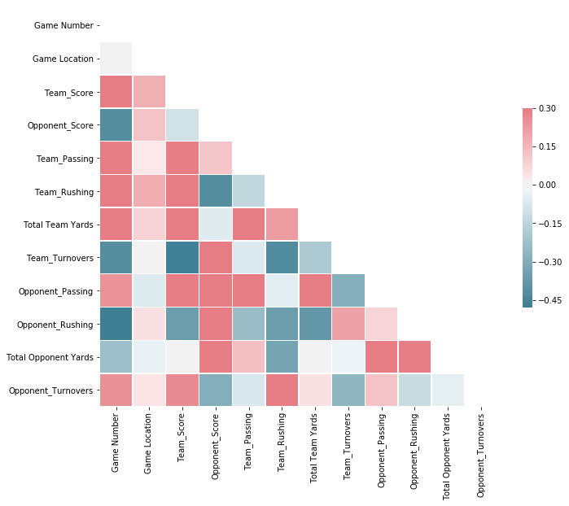

# **Super_Bowl_Prediction_2018**
The goal of this project is to predict the final result for super bowl based on the 2018 games. Since unlike to predict the other kinds of categories, to predict the result of sports should use the latest data. The change of player/coach or the strategy/tactic the team uses could heavily affect the prediction. In this case, to preform this prediction for Super Bowl, I use the data from [NFL 2018 season](https://github.com/Yiting2018/Super_Bowl_Prediction_2018/blob/gh-pages/docs/NFL%2B2018%2BSeason%2BData.xlsx).

To build the Linear Regression Model, I used the variables of Opponent,	Game Location, Team_Score, Opponent_Score, Team_Passing, Team_Rushing, Total Team Yards, Team_Turnovers, Opponent_Passing, Opponent_Rushing, Total Opponent Yards and Opponent_Turnovers.

As we can see in the following, both of the plot and score show a strong linear relationship.

Regarding the Game Location, I set it to dummy variables. Since Rams will be the home team, I manually changed it to 1 as HOME, and the Game Location for Patriots is 0 as AWAY.

In order to conduct the prediction, I used the average performance of each team (Rams and Patriots) as the values and got the final result of 29:27, Rams wins. I chose the average as the values is beacuse I believe the average could show how the team is currently doing.

The funny thing is **I don't really understand this sport, but I can still build a model to predict the result**, even though my predition was proved wrong lol. I guess this is the beauty of the competition.

## Code
Please see the [Jupyter Notebook](https://yiting2018.github.io/NFL_Prediction.html) for details.

### [Go Back to Homepage](https://yiting2018.github.io)
